# omnivoice-server — Architecture Document

> **Version**: 2026-04-04
> **Status**: Pre-implementation
> **Audience**: Developers implementing or onboarding to this project

---

## Table of contents

- [omnivoice-server — Architecture Document](#omnivoice-server--architecture-document)
  - [Table of contents](#table-of-contents)
  - [1. Ecosystem positioning](#1-ecosystem-positioning)
    - [Why this repo exists](#why-this-repo-exists)
    - [Relation to similar projects](#relation-to-similar-projects)
  - [2. Layer architecture](#2-layer-architecture)
    - [Layer responsibilities](#layer-responsibilities)
  - [3. Internal component map](#3-internal-component-map)
  - [4. Concurrency model](#4-concurrency-model)
    - [Key invariants](#key-invariants)
    - [What happens under load](#what-happens-under-load)
  - [5. Request lifecycle — non-streaming](#5-request-lifecycle--non-streaming)
  - [6. Request lifecycle — streaming](#6-request-lifecycle--streaming)
    - [Streaming response headers](#streaming-response-headers)
    - [Streaming vs non-streaming trade-offs](#streaming-vs-non-streaming-trade-offs)
  - [7. Voice mode decision tree](#7-voice-mode-decision-tree)
  - [8. Startup \& shutdown sequence](#8-startup--shutdown-sequence)
    - [Startup failure modes](#startup-failure-modes)
  - [9. Profile storage schema](#9-profile-storage-schema)
  - [10. Service dependency graph](#10-service-dependency-graph)
  - [11. Error taxonomy](#11-error-taxonomy)

---

## 1. Ecosystem positioning

This diagram shows **where `omnivoice-server` sits in the broader stack**, from end-user clients down to model weights on disk.

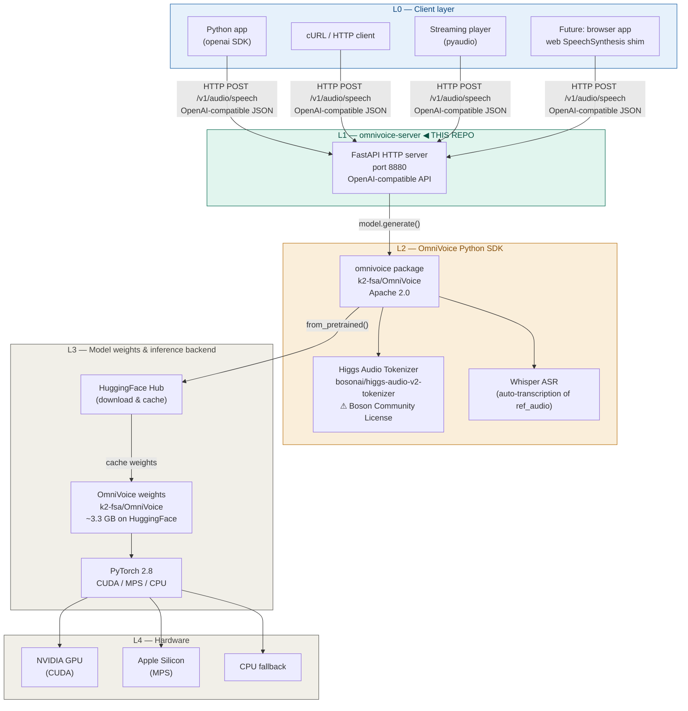

### Why this repo exists

OmniVoice ships a Python API and a CLI, but **no HTTP server**. That means:
- No drop-in replacement for `api.openai.com/v1/audio/speech`
- No persistent voice profiles across requests
- No concurrent request handling or semaphore-based backpressure
- No observability (`/health`, `/metrics`)

`omnivoice-server` fills this gap as a thin, stateless-ish HTTP adapter layer. It adds **no new ML capabilities** — it only makes the existing ones accessible over HTTP with proper concurrency semantics.

### Relation to similar projects

| Project                     | Model     | OpenAI-compat | Voice cloning         | MPS support |
| --------------------------- | --------- | ------------- | --------------------- | ----------- |
| **omnivoice-server** (this) | OmniVoice | ✅             | ✅ persistent profiles | ✅           |
| kokoro-fastapi              | Kokoro    | ✅             | ❌                     | ❌           |
| CoquiAI/TTS server          | XTTS v2   | ❌             | ✅                     | ❌           |
| local-ai                    | multiple  | ✅             | partial               | partial     |

---

## 2. Layer architecture

Internal layers of `omnivoice-server` itself, from HTTP surface down to hardware.

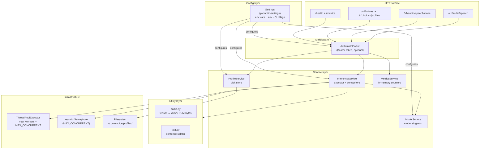

### Layer responsibilities

| Layer                      | Responsibility                                                     | Does NOT do               |
| -------------------------- | ------------------------------------------------------------------ | ------------------------- |
| **HTTP surface** (routers) | Parse/validate request, format response, map errors to HTTP status | Business logic            |
| **Middleware**             | Auth gate, future: rate limiting                                   | Routing                   |
| **Service layer**          | Orchestrate inference, manage state, record metrics                | HTTP concerns             |
| **Utility layer**          | Pure functions (audio encoding, text splitting)                    | Side effects              |
| **Config layer**           | Single source of truth for all tunables                            | Validation beyond type    |
| **Infrastructure**         | Thread pool, semaphore, filesystem                                 | Awareness of domain logic |

---

## 3. Internal component map

Static view of all modules and their relationships.

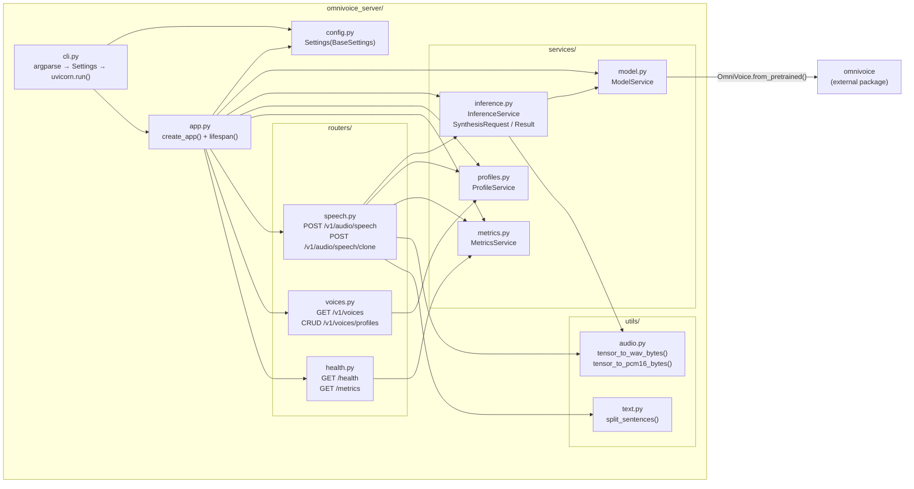

---

## 4. Concurrency model

This is the most important architectural decision. Understand this before touching `InferenceService`.

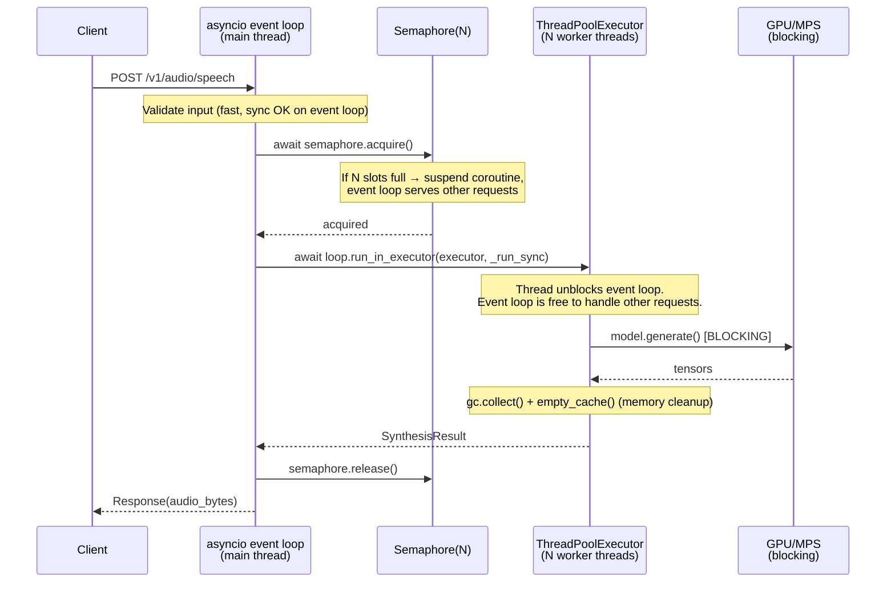

### Key invariants

| Rule                                   | Why                                                                                                  |
| -------------------------------------- | ---------------------------------------------------------------------------------------------------- |
| `workers=1` in uvicorn                 | One model in VRAM. Multi-process = N copies of weights.                                              |
| `ThreadPoolExecutor(max_workers=N)`    | N = `MAX_CONCURRENT` (default 2). Matches semaphore.                                                 |
| `asyncio.Semaphore(N)`                 | Prevents > N concurrent inferences. Queue forms in the event loop.                                   |
| `await asyncio.wait_for(..., timeout)` | Wraps executor call. Raises `TimeoutError` after `request_timeout_s`.                                |
| `_cleanup_memory()` in `finally`       | Runs on every inference — success or exception. Mitigates Torch 2.8 memory leak (upstream issue #9). |

### What happens under load

```
1 request  → runs immediately
2 requests → both run simultaneously (N=2 default)
3 requests → req #3 suspends on semaphore, event loop stays live
             req #3 resumes when req #1 or #2 completes
N+k requests → k requests queue in asyncio, none are rejected
              (until request_timeout_s exceeded → 504)
```

---

## 5. Request lifecycle — non-streaming

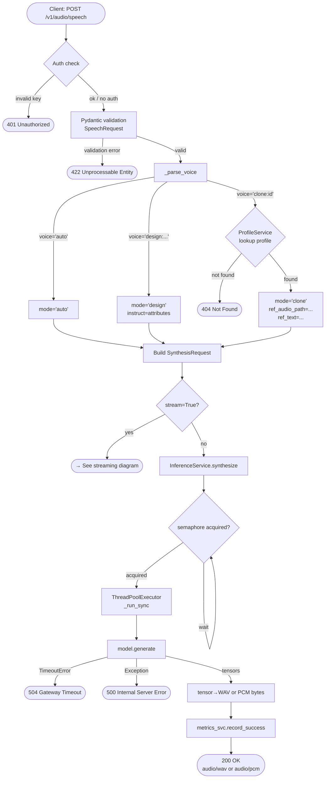

---

## 6. Request lifecycle — streaming

Streaming splits the input into sentences and synthesizes each independently, yielding PCM chunks as they complete.

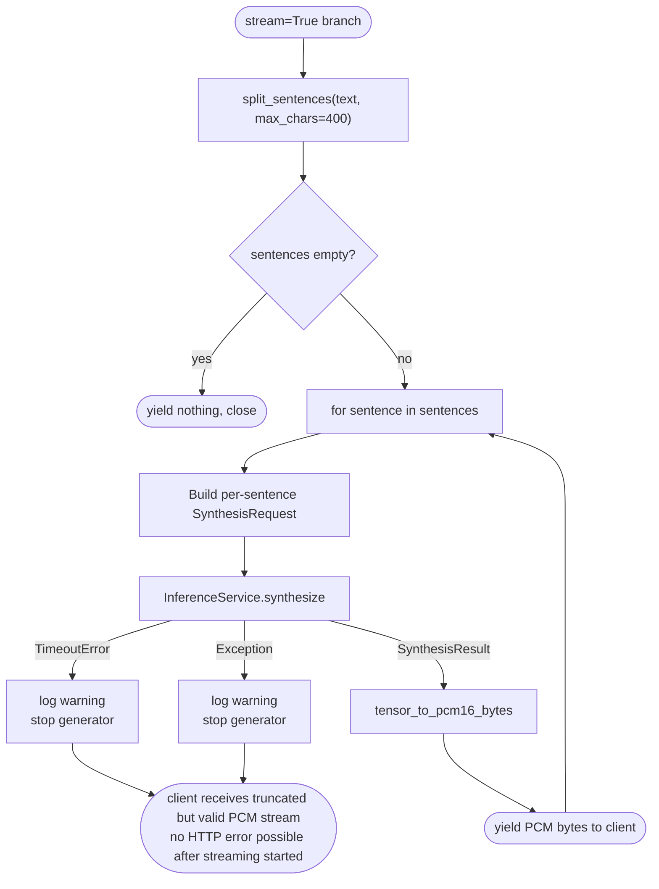

### Streaming response headers

```
Content-Type: audio/pcm
X-Audio-Sample-Rate: 24000
X-Audio-Channels: 1
X-Audio-Bit-Depth: 16
X-Audio-Format: pcm-int16-le
Transfer-Encoding: chunked
```

Client must know these params **before** the first byte arrives — they are in the HTTP response headers, not embedded in the audio stream (no WAV header).

### Streaming vs non-streaming trade-offs

|                  | Non-streaming                | Streaming                               |
| ---------------- | ---------------------------- | --------------------------------------- |
| First audio byte | After full synthesis         | After first sentence                    |
| Latency (TTFA)   | High (~RTF × total_duration) | Low (~RTF × first_sentence)             |
| Error recovery   | HTTP 500/504                 | Truncated stream (silent)               |
| Metrics recorded | ✅ per request                | ✅ per sentence chunk *(see fix §below)* |
| Use case         | Batch, short texts           | Real-time, long texts                   |

---

## 7. Voice mode decision tree

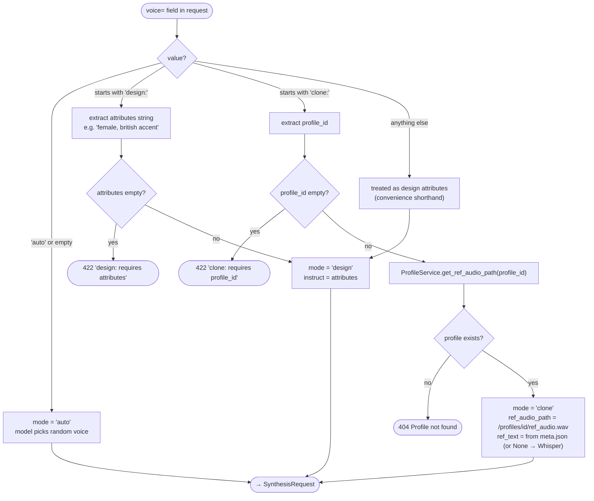

---

## 8. Startup & shutdown sequence

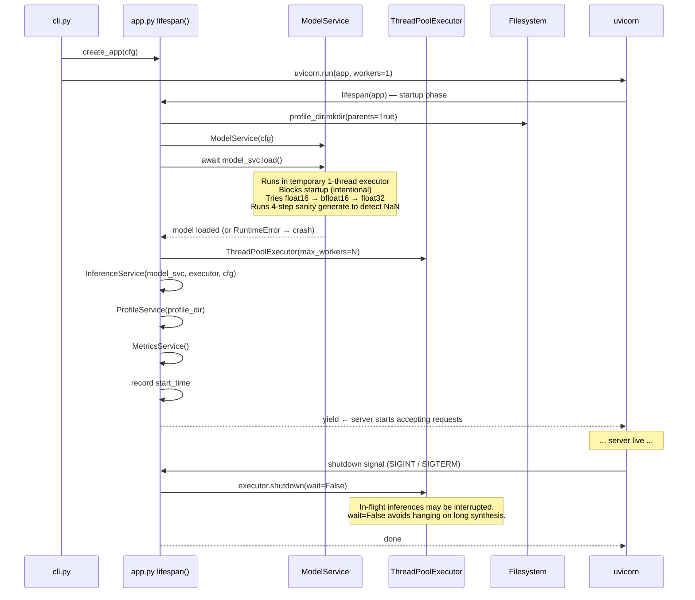

### Startup failure modes

| Failure                             | Outcome                                                  |
| ----------------------------------- | -------------------------------------------------------- |
| All dtype candidates fail on device | `RuntimeError` — process exits, no port bound            |
| Profile dir not writable            | `PermissionError` on first profile write, not at startup |
| HuggingFace unreachable (no cache)  | `OSError` from `from_pretrained()` — process exits       |
| Port already in use                 | uvicorn error before lifespan runs                       |

---

## 9. Profile storage schema

Voice cloning profiles are stored on disk under `~/.omnivoice/profiles/` (configurable).

```
~/.omnivoice/
└── profiles/
    ├── alice-voice/
    │   ├── ref_audio.wav          ← reference audio (any duration, recommend 5–30s)
    │   └── meta.json              ← profile metadata
    ├── narrator-deep/
    │   ├── ref_audio.wav
    │   └── meta.json
    └── ...
```

**`meta.json` schema:**

```json
{
  "name": "alice-voice",
  "ref_text": "Hello, this is a sample of my voice for cloning.",
  "created_at": "2026-04-04T12:00:00+00:00"
}
```

| Field        | Type           | Description                                                                  |
| ------------ | -------------- | ---------------------------------------------------------------------------- |
| `name`       | string         | Same as `profile_id` (directory name)                                        |
| `ref_text`   | string \| null | Transcript of `ref_audio.wav`. `null` → Whisper auto-transcribes on each use |
| `created_at` | ISO 8601 UTC   | Creation timestamp                                                           |

**Profile ID constraints:** `^[a-zA-Z0-9_-]{1,64}$` — alphanumeric, dashes, underscores only. Enforced at both API (Pydantic) and storage (sanitize function) layers.

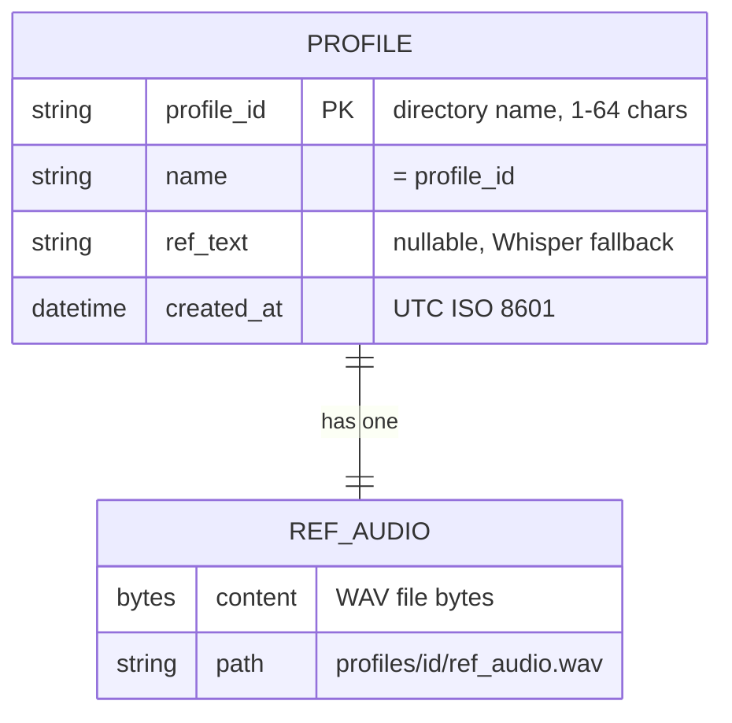

---

## 10. Service dependency graph

Which services depend on which, and what shared state they own.

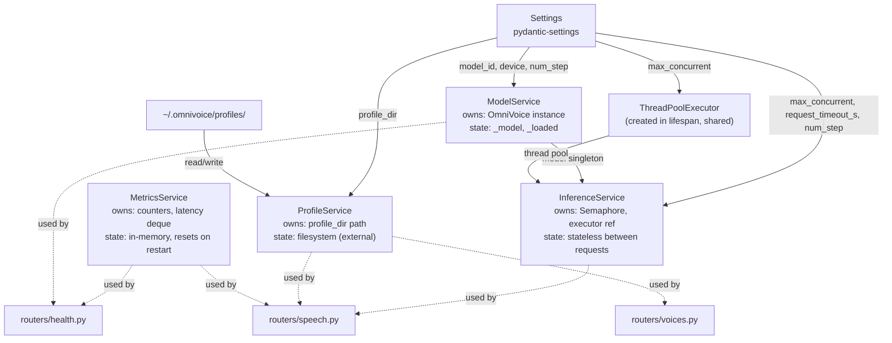

---

## 11. Error taxonomy

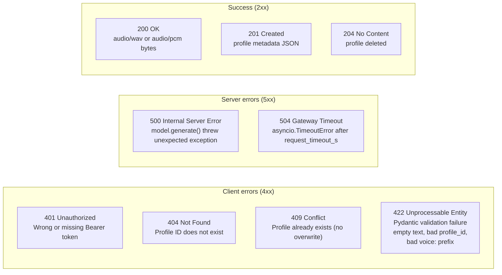

---

*Document generated from [../system/specification.md](../system/specification.md) v2026-04-04. See [../design/dataflow.md](../design/dataflow.md) for per-endpoint data flow details.*
