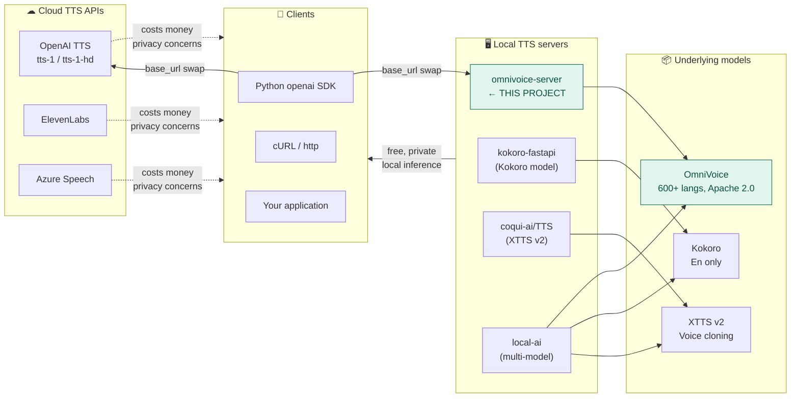
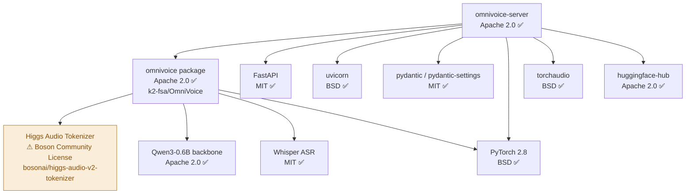

# omnivoice-server — Ecosystem & Deployment Guide

> How this server fits into the broader AI audio ecosystem, and what you need to know before deploying.

---

## The TTS server landscape (2026)



### Where omnivoice-server is uniquely positioned

- **Broadest language coverage in local TTS**: OmniVoice supports 600+ languages — no competitor in the local-server space comes close.
- **OpenAI drop-in on Mac**: The only local TTS server with first-class MPS (Apple Silicon) support and OpenAI-compatible API.
- **Voice design without samples**: `voice="design:female,british accent"` works with no reference audio — unique to OmniVoice.
- **Persistent cloned profiles**: Upload once, reuse by ID — eliminates the overhead of uploading ref audio on every request.

---

## Dependency risk register



### Higgs Audio Tokenizer — license summary

| Question                         | Answer                                                                     |
| -------------------------------- | -------------------------------------------------------------------------- |
| License                          | Boson Community License (based on Llama 3 Community License)               |
| Commercial use allowed?          | **Yes**, for products with < 700M MAU                                      |
| Attribution required?            | Yes — "Built with Higgs Audio" in product                                  |
| Redistribution                   | Allowed with license terms                                                 |
| Status                           | ⚠ Open discussion on k2-fsa/OmniVoice HuggingFace page about compatibility |
| Action for personal/internal use | **Proceed** — no issue                                                     |
| Action for commercial SaaS       | Monitor upstream discussion before launch                                  |

---

## Hardware requirements

| Device              | Minimum VRAM/RAM | Recommended    | RTF (num_step=16)              |
| ------------------- | ---------------- | -------------- | ------------------------------ |
| NVIDIA GPU (CUDA)   | 6 GB VRAM        | 8+ GB VRAM     | ~0.025–0.05                    |
| Apple Silicon (MPS) | 8 GB unified     | 16+ GB unified | ~0.1–0.3                       |
| CPU (x86/ARM)       | 16 GB RAM        | 32 GB RAM      | ~1.5–4.0 (real-time or slower) |

> **RTF < 1.0 means faster than real-time.** RTF = synthesis latency / audio duration.
> CPU inference is generally too slow for interactive use. Use for testing only.

---

## Deployment topologies

### Topology 1 — Local developer machine

```
┌─────────────────────────────────┐
│  macOS / Linux workstation      │
│                                 │
│  omnivoice-server               │
│  listening on 127.0.0.1:8880    │
│                                 │
│  Your app (same machine)        │
│  → http://localhost:8880        │
└─────────────────────────────────┘
```

```bash
omnivoice-server --device mps --num-step 16 --port 8880
```

No auth needed. Default bind `127.0.0.1` means port is not exposed to network.

---

### Topology 2 — Dedicated inference host (LAN)

```
┌──────────────────────────────────────────────────────────────┐
│  LAN                                                         │
│                                                              │
│  ┌─────────────────────┐         ┌──────────────────────┐   │
│  │ Inference host      │         │ Application server   │   │
│  │ (Mac Studio / GPU)  │         │                      │   │
│  │                     │◄────────│ openai.Client(       │   │
│  │ omnivoice-server    │  HTTP   │   base_url=          │   │
│  │ 0.0.0.0:8880        │         │   "http://gpu:8880"  │   │
│  │ --api-key $SECRET   │         │ )                    │   │
│  └─────────────────────┘         └──────────────────────┘   │
└──────────────────────────────────────────────────────────────┘
```

```bash
# On inference host:
omnivoice-server \
  --host 0.0.0.0 \
  --port 8880 \
  --device cuda \
  --api-key "$OMNIVOICE_API_KEY" \
  --max-concurrent 4
```

```python
# On application server:
from openai import OpenAI

client = OpenAI(
    base_url="http://gpu-host:8880/v1",
    api_key=os.environ["OMNIVOICE_API_KEY"],
)

response = client.audio.speech.create(
    model="omnivoice",
    voice="auto",
    input="Hello from OmniVoice!",
)
response.stream_to_file("output.wav")
```

---

### Topology 3 — Behind nginx reverse proxy (production)

```
Internet
   │
   ▼
┌──────────────────────────────────────────────────────────────┐
│  nginx (TLS termination, rate limiting, client_max_body_size)│
│  listen 443 ssl                                              │
│  proxy_pass http://127.0.0.1:8880                            │
│  client_max_body_size 30M;   ← guards against large uploads  │
└──────────────────────────────────────────────────────────────┘
   │
   ▼
┌──────────────────────────────────────────────────────────────┐
│  omnivoice-server (127.0.0.1:8880)                           │
│  --api-key $SECRET                                           │
└──────────────────────────────────────────────────────────────┘
```

Sample nginx config:

```nginx
server {
    listen 443 ssl;
    server_name tts.yourdomain.com;

    ssl_certificate     /etc/ssl/certs/your.crt;
    ssl_certificate_key /etc/ssl/private/your.key;

    # Protect against large ref_audio uploads
    client_max_body_size 30M;

    # Streaming: disable proxy buffering so chunks reach client immediately
    proxy_buffering off;
    proxy_read_timeout 300s;    # must exceed request_timeout_s (120s) + margin

    location / {
        proxy_pass         http://127.0.0.1:8880;
        proxy_set_header   Host $host;
        proxy_set_header   X-Real-IP $remote_addr;
    }
}
```

---

## Environment variables reference

All settings can be set via env vars with the `OMNIVOICE_` prefix.

```bash
# Server
OMNIVOICE_HOST=127.0.0.1
OMNIVOICE_PORT=8880
OMNIVOICE_LOG_LEVEL=info             # debug | info | warning | error

# Model
OMNIVOICE_MODEL_ID=k2-fsa/OmniVoice # or local path
OMNIVOICE_DEVICE=auto                # auto | cuda | mps | cpu
OMNIVOICE_NUM_STEP=16                # 1–64; lower = faster, lower quality

# Inference
OMNIVOICE_MAX_CONCURRENT=2           # parallel inference slots
OMNIVOICE_REQUEST_TIMEOUT_S=120      # seconds before 504

# Storage
OMNIVOICE_PROFILE_DIR=~/.omnivoice/profiles

# Auth (optional)
OMNIVOICE_API_KEY=                   # empty = no auth

# Streaming
OMNIVOICE_STREAM_CHUNK_MAX_CHARS=400 # chars per sentence chunk

# Patch P2 addition
OMNIVOICE_MAX_REF_AUDIO_MB=25        # max upload size for ref_audio
```

---

## Quick-start checklist

```
Prerequisites:
  [ ] Python 3.10+
  [ ] PyTorch 2.8 installed with correct backend (CUDA/MPS/CPU)
  [ ] pip install omnivoice  (downloads ~3.3 GB weights on first run)

Installation:
  [ ] git clone https://github.com/<you>/omnivoice-server
  [ ] pip install -e ".[dev]"
  [ ] omnivoice-server --help   (Checkpoint: should print usage without error)

Development smoke test (no GPU needed):
  [ ] pytest tests/   (uses mock model, no real inference)

Real inference test:
  [ ] omnivoice-server --device mps --num-step 4 --log-level debug
  [ ] curl -X POST http://localhost:8880/v1/audio/speech \
        -H "Content-Type: application/json" \
        -d '{"input":"Hello world","voice":"auto"}' \
        --output test.wav
  [ ] aplay test.wav  (or open with any audio player)
  [ ] curl http://localhost:8880/health
```
